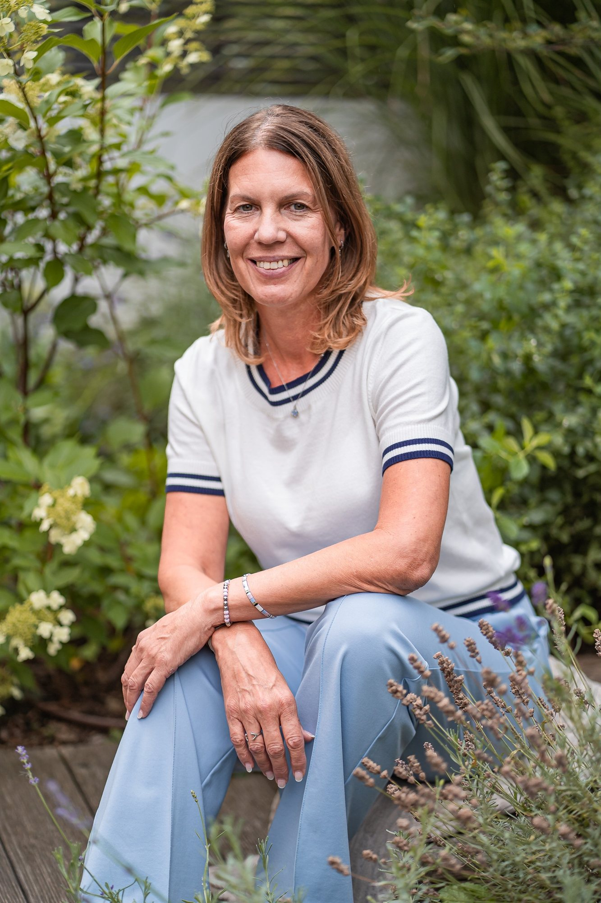

# Váš web — návod

Ahoj Katko,

tenhle soubor je návod k webu. Je psaný pro člověka, ne pro programátora.
Nemusíte nic instalovat a nemusíte umět programovat. Když si nebudete jistá,
**nic nerozbijete** — vždycky si stačí předem uložit kopii složky.

---

## Obsah

1. [Jak web otevřít na svém počítači](#1-jak-web-otevřít-na-svém-počítači)
2. [Jak přepsat text](#2-jak-přepsat-text)
3. [Jak změnit cenu](#3-jak-změnit-cenu)
4. [Kam nahrát fotky (a jaké fotky potřebujeme)](#4-kam-nahrát-fotky)
5. [Jak vložit skutečné reference](#5-jak-vložit-skutečné-reference)
6. [Jak zapnout online rezervaci](#6-jak-zapnout-online-rezervaci)
7. [Certifikáty](#7-certifikáty--hotovo-a-jak-je-vyměnit)
8. [Co je potřeba doplnit](#8-co-je-potřeba-doplnit)
9. [Co znamenají jednotlivé soubory](#9-co-znamenají-jednotlivé-soubory)
10. [Časté drobnosti](#10-časté-drobnosti)

---

## 1. Jak web otevřít na svém počítači

**Nejrychleji:** poklepejte na soubor `index.html`. Web se otevře v prohlížeči.
Takhle uvidíte skoro všechno.

**Správně (doporučeno):**

1. Stáhněte si zdarma program **Visual Studio Code** (visualstudio.com/code).
2. Otevřete v něm složku s webem: *Soubor → Otevřít složku…*
3. Vlevo dole klikněte na *Extensions* (ikonka kostiček), vyhledejte
   **Live Server** a nainstalujte.
4. Klikněte pravým tlačítkem na `index.html` → **Open with Live Server**.

Web se otevře a při každé úpravě se sám obnoví. Tohle je nejpohodlnější
způsob, jak zkoušet změny.

> Web **nepotřebuje žádné sestavení, žádnou instalaci, žádný účet**.
> Jsou to obyčejné soubory. Když je nahrajete na hosting, prostě fungují.

---

## 2. Jak přepsat text

Všechen text je v souborech, které končí `.html`. Každý odpovídá jedné stránce:

| Soubor | Stránka na webu |
|---|---|
| `index.html` | Úvod |
| `kraniosakralni-terapie.html` | O terapii |
| `s-cim-pomaham.html` | S čím pomáhám |
| `o-mne.html` | O mně |
| `prubeh-a-cenik.html` | Průběh a ceník |
| `404.html` | Stránka, která se ukáže při špatném odkazu |

**Postup:**

1. Otevřete soubor ve VS Code.
2. Stiskněte `Ctrl+F` (na Macu `Cmd+F`) a najděte větu, kterou chcete změnit.
3. Přepište **jen text mezi značkami**. Značky vypadají takhle: `<p>` a `</p>`.

```html
<p>Tady je text, který můžete klidně přepsat.</p>
   ↑ tohle nechte     ↑ přepište tohle      ↑ tohle nechte
```

4. Uložte (`Ctrl+S`). Hotovo.

**Na co si dát pozor:**

- Nemažte lomené závorky `<` a `>`. Jsou to „obaly“ textu.
- Když ve větě uvidíte `&nbsp;`, je to **nezlomitelná mezera**. Drží k sobě
  slova, která se nemají rozdělit na konci řádku — třeba `v&nbsp;oblečení`
  nebo `1&nbsp;500&nbsp;Kč`. Když píšete nový text, klidně napište obyčejnou
  mezeru; web bude fungovat. Jen to bude o vlásek méně hezké.
- Uvozovky v textu jsou české: `„takhle“`. Napíšete je ve VS Code tak, že je
  zkopírujete odsud.

---

## 3. Jak změnit cenu

Cena je na webu na **třech místech**. Musíte ji změnit na všech třech,
jinak si budou stránky odporovat.

1. `index.html` — sekce Ceník (najděte `1 500 Kč`)
2. `prubeh-a-cenik.html` — sekce Ceník **a** hlavička nahoře (`Od 1 500 Kč`)
3. `s-cim-pomaham.html` — v hlavičce nahoře (`1 500 Kč`)

**Nejjistější postup:** ve VS Code stiskněte `Ctrl+Shift+F` (hledání ve všech
souborech), napište `1 500 Kč` a projděte všechny výsledky.

> Nezapomeňte i na **strukturovaná data** — to je blok, který začíná
> `"@type": "Offer"` v souboru `index.html`. Tam je cena zapsaná znovu,
> tentokrát bez mezer a bez „Kč“ (`"price": "1500"`). Slouží pro Google.

---

## 4. Kam nahrát fotky

Fotky patří do složky `assets/`. Na webu je připraveno **pět míst**.
Než tam fotku vložíte, musí se pojmenovat přesně takhle:

| Soubor | Kde se objeví | Formát |
|---|---|---|
| `assets/katka-portret.jpg` | Úvod | na výšku, 4:5 |
| `assets/katka-portret-omne.jpg` | O mně — hero nahoře | na výšku, 4:5 |
| `assets/ruce-hlava.jpg` | O terapii, nahoře | na výšku, 4:5 |
| `assets/mistnost.jpg` | O mně — široký pás za I. kapitolou | na šířku, 16:7 |
| `assets/ruce-prace.jpg` | O mně — vedle II. kapitoly, na okraji | na výšku, 4:5 |
| `assets/ruce-detail.jpg` | O mně — dvojice obrazů, vlevo | na šířku, 3:2 |
| `assets/rozhovor.jpg` | O mně — dvojice obrazů, vpravo | na šířku, 3:2 |
| `assets/katka-pracovna.jpg` | O mně — široký pás před závěrem | na šířku, 16:7 |

> **Pozn.:** stránka O mně je nově psaná jako **článek** — kapitoly, text
> a mezi nimi obrazy. Fotek proto přibyla dvě místa (`ruce-prace.jpg`
> a `katka-pracovna.jpg`). Dokud tam fotky nejsou, stránka funguje: místo
> obrázku je světlý obdélník s popiskem, co tam patří. **Nic se
> nerozbije, když je budete doplňovat postupně.**

**Co na dvě nové fotky potřebujeme (stručně):**

- `ruce-prace.jpg` — vaše ruce při práci, na výšku. Klidně bez tváře;
  důležitý je klid a ostrost na prstech.
- `katka-pracovna.jpg` — vy v pracovně, na šířku. Nemusí to být portrét
  na střed; klidně od lehátka, s prostorem kolem.

**Jak fotku vložit** — najděte v HTML blok, který má nad sebou komentář
`FOTOGRAFIE 01`, `FOTOGRAFIE 02` … Vypadá takhle:

```html
<figure class="photo photo--4x5">
  <div class="photo__ph"> … </div>
</figure>
```

a nahraďte celý vnitřek jedním řádkem:

```html
<figure class="photo photo--4x5">
  
</figure>
```

U dvou fotek na stránce *O mně* je rám zabalený ještě do `<figure class="figure">`,
protože pod ním stojí popiska. Tam měňte jen vnitřek `<div class="photo …">`
a popisku nechte být.

> **Popisku pod fotkou nechte tam, kde je** — tedy vedle `<div class="photo">`,
> ne uvnitř něj. Rám fotky má pevný poměr stran a všechno, co se do něj
> vloží navíc, skončí přes obrázek.

Do `alt=""` napište, co na fotce je — čtou to nevidomí návštěvníci a Google.

### Foto brief — co si objednat u fotografa

Tohle prosím pošlete fotografovi. Je to nejdůležitější věc, která webu
zatím chybí: **bez vaší fotky si lidé sezení neobjednají.**

**Co potřebujeme (5 snímků):**

1. **Portrét, formát 4:5** — vy, od pasu nahoru, díváte se do objektivu.
   Klidný, přátelský výraz. Ostrost na oči.
2. **Ruce na hlavě klienta, detail** — záběr shora nebo z boku, jen ruce
   a část hlavy. Nesmí být poznat tvář klienta.
3. **Místnost s lehátkem, formát 3:2** — prázdná, uklizená, denní světlo.
   Ať je vidět, že je to normální klidný pokoj.
4. **Detail rukou** — vaše ruce, jak spočívají. Bez klienta.
5. **Rozhovor vsedě, formát 3:2** — dvě křesla, přirozená pozice.

**Jak to má vypadat:**

- Přirozené světlo od okna. **Žádný blesk.**
- Teplé, neutrální barvy — žádné filtry, žádná modrá „studená“ úprava.
- **Žádné stock fotky.** Ani jednu.
- **Žádné bílé pláště.** Nejste v nemocnici.
- **Žádné kameny, svíčky, orchideje ani vonné tyčinky.** Není to wellness.
- Rozlišení alespoň **2000 px** na delší straně.
- Formáty: portrét 4:5, ostatní 3:2.

**Jak fotky připravit před nahráním:** zmenšete je na max 2000 px na delší
straně a uložte jako JPG v kvalitě ~80 %. Zdarma to udělá třeba
[squoosh.app](https://squoosh.app) přímo v prohlížeči. Fotky přímo z foťáku
(5–10 MB) by web zpomalily.

---

## 5. Jak vložit skutečné reference

**Sekce s referencemi je na webu záměrně vypnutá.**

Na předchozí verzi webu byly reference vymyšlené jako ukázka. To se u webu
zdravotně orientované služby dělat nesmí — je to nefér vůči lidem, kteří se
podle nich rozhodují, a může to být i právní problém. Proto tam nejsou.

**Až budete mít od klientů skutečné vyjádření (a jejich souhlas):**

1. Otevřete `index.html`.
2. Najděte `07 SLOVA KLIENTŮ`. Je tam velký komentář — text mezi
   `<!--` a `-->`.
3. Smažte řádek `<!--` (a popisný text nad kostrou) a řádek `-->` na konci.
4. Doplňte skutečné citace. Pro každou přidejte blok:

```html
<figure class="voice" data-voice>
  <blockquote class="voice__text">„Sem přijde přesně to, co klient napsal.“</blockquote>
  <figcaption class="voice__by">Jana K. · migréna</figcaption>
</figure>
```

5. Do `voices__counter` napište, kolik jich je (`01 / 05`).

**Souhlas si vyžádejte písemně** — stačí e-mail ve stylu:
*„Souhlasím se zveřejněním svého vyjádření na webu pod jménem Jana K.“*
Uschovejte si ho.

---

## 6. Jak zapnout online rezervaci

Na dvou místech je označené místo `PLACEHOLDER: Reservio / Calendly embed` —
v `index.html` a v `prubeh-a-cenik.html`, v sekci **Objednání**.

1. Založte si účet u **Reservio** (české, umí i platby) nebo **Calendly**.
2. V jejich administraci najděte „Vložit na web“ / „Embed“ a zkopírujte kód.
3. V HTML nahraďte celý řádek
   `<span class="todo">PLACEHOLDER: Reservio / Calendly embed</span>`
   vloženým kódem.
4. Smažte větu *„Než bude spuštěná, použijte prosím telefon nebo e-mail.“*

> **Upozornění k soukromí:** rezervační systém je služba třetí strany. Jakmile
> ho vložíte, budou se do něj načítat data z cizího serveru a nejspíš budete
> potřebovat i lištu se souhlasem s cookies a odkaz na zásady zpracování
> osobních údajů. Zeptejte se poskytovatele — obvykle k tomu mají hotový text.

---

## 7. Certifikáty — hotovo, a jak je vyměnit

Na stránce **O mně** je pod tabulkou výcviků sekce **„Ne slovo, ale papír.“**
Jsou v ní obě osvědčení jako obrázky; klepnutím se otevřou v plné velikosti.

Soubory leží v `assets/certifikaty/`:

| Soubor | Co to je |
|---|---|
| `bi-diplom.jpg` | diplom Body Intelligence — velká verze pro zvětšení |
| `bi-diplom-nahled.jpg` | týž diplom, malý — ten se ukazuje na kartě |
| `ease-sep.jpg` | osvědčení EASE — velká verze |
| `ease-sep-nahled.jpg` | týž doklad, malý |

**Kdyby přibyl další certifikát nebo se některý měnil:**

1. Naskenujte ho a uložte do `assets/certifikaty/` pod novým jménem.
   Udělejte **dvě velikosti** — velkou (delší strana ≈ 1500 px) a náhled
   (delší strana ≈ 760 px). Náhled je tam proto, aby se stránka rychle
   načetla; velká se stáhne, teprve když si ji někdo otevře.
2. V `o-mne.html` najděte `data-cert-open` a přepište obě cesty (velkou
   v `data-cert-open`, náhled v `src` obrázku pod ním).
3. Přepište i text karty — vydavatele, název, rozsah, datum a číslo.
   Je to obyčejná sazba, nic zvláštního.

> **Co na kartě NEMĚŇTE:** popis obrázku (`alt`). Čte ho člověk, který
> na obrázek nevidí, a taky Google. Má v něm být, co na papíře stojí.

**Loga akreditací** (BCTA, AFTCSB, PACT, IABT, NHPC) jsou na kartě
napsaná jako text, ne vložená jako obrázky — cizí logo se bez licence
nekopíruje. Kdo je chce vidět, najde je na samotném diplomu po zvětšení.

---

## 8. Co je potřeba doplnit

Všechna nedodělaná místa jsou na webu **vidět** — jsou v pískovém rámečku
a začínají slovem `DOPLNIT` nebo `PLACEHOLDER`. Najdete je i ve VS Code:
`Ctrl+Shift+F` a hledejte `DOPLNIT`.

| Co | Kde | Proč to je důležité |
|---|---|---|
| **Adresa a mapa** | `prubeh-a-cenik.html`, sekce *Kde mě najdete* + patičky všech stránek | Bez adresy si místní službu lidé neobjednají. Nejdůležitější položka na seznamu. |
| **Fotografie** | `assets/`, viz kapitola 4 | Druhá nejdůležitější. Lidé si objednávají člověka, ne metodu. |
| **Skutečné reference** | `index.html`, viz kapitola 5 | Sociální důkaz. Sekce je zatím vypnutá. |
| **Online rezervace** | viz kapitola 6 | Třetí cesta k objednání pro ty, kdo neradi telefonují. |
| **IČO a sídlo** | patička všech stránek | Zákonná povinnost podnikatele. |
| **Věta „Nejsem poskytovatel zdravotních služeb…“** | patička | Právní ochrana. Text si nechte schválit. |
| **Potvrzení cen a otevírací doby** | viz kapitola 3 | Ceny jsou převzaté z předchozího webu — prosím ověřte, že platí. |
| **Skutečná doména** | ve všech `.html` v řádcích `canonical`, `og:url` a v `sitemap.xml` | Teď je tam `www.example.cz`. Až budete mít doménu, přepište. |

---

## 9. Co znamenají jednotlivé soubory

```
kranio-web-v2/
├── index.html …………………… Úvodní stránka
├── kraniosakralni-terapie.html … O terapii
├── s-cim-pomaham.html ………… S čím pomáhám
├── o-mne.html ………………………… O mně
├── prubeh-a-cenik.html ………… Průběh & ceník
├── 404.html …………………………… Stránka „nenalezeno“
├── styleguide.html …………… Interní ukázka písma a barev.
│                             Není v menu a Google ji nevidí.
│                             Klidně ji smažte, nic se nestane.
│
├── css/ ……………………………………… Vzhled
│   ├── tokens.css ………………… BARVY, PÍSMA, VELIKOSTI.
│   │                         Tady měňte vzhled. Nikde jinde.
│   ├── base.css ……………………… základní sazba textu
│   ├── layout.css ………………… rozvržení, menu, patička
│   ├── components.css ……… tlačítka, štítky, panely
│   └── modules.css ………………… interaktivní části
│
├── js/ …………………………………………… chování (animace, moduly)
│   ├── core.js ………………………… společný základ všech modulů
│   ├── webgl/ ……………………………… postava v úvodní sekci (3D)
│   └── modules/ …………………………… jednotlivé interaktivní části:
│                             say.js (věta na úvodu, která
│                             se rozsvítí a pak povolí),
│                             wheel-core.js + session-wheel.js
│                             (kolo sezení — běží na dvou
│                             stránkách ze stejného kódu),
│                             help-index.js (rejstřík obtíží) …
├── fonts/ ……………………………………… písma (nemazat)
├── vendor/ ……………………………… cizí knihovna Lenis (nemazat)
├── assets/ ……………………………… obrázky, ikony, sem patří fotky
│   └── screens/ ……………………… screenshoty do dokumentace.
│                             Na web je nepotřebujete — před
│                             nahráním na hosting je klidně smažte
│                             (ušetříte 5 MB).
│
├── sitemap.xml ……………………… mapa webu pro Google
├── robots.txt ………………………… pokyny pro vyhledávače
├── README.md ………………………… tenhle návod
├── DESIGN.md ………………………… proč web vypadá, jak vypadá
└── OBSAH.md …………………………… kontrola, že se nic neztratilo
```

**Co nikdy nemažte:** složky `fonts/`, `vendor/`, `css/`, `js/`.
Bez nich se web rozpadne.

---

## 10. Časté drobnosti

**Chci změnit barvu.**
Otevřete `css/tokens.css`. Nahoře jsou všechny barvy pojmenované.
Zelená akční barva je `--tide`. Změníte ji na jednom místě a změní se
na celém webu. **Pozor:** když ji hodně zesvětlíte, přestane být čitelná
bílý text na tlačítkách.

**Chci změnit telefon nebo e-mail.**
`Ctrl+Shift+F`, hledejte `776 021 297` a `katkajuttnerova@seznam.cz`.
Telefon je na webu dvakrát v každém souboru — jednou jako text
(`+420 776 021 297`) a jednou jako odkaz (`tel:+420776021297`, bez mezer).
Změňte obojí.

**Chci změnit barvu drobného textu.**
V `css/tokens.css` jsou čtyři odstíny inkoustu a jeden navíc:
`--ink-meta`. Ten patří **nejdrobnějšímu textu** (číslovky, popisky pod
grafy) a je schválně tmavší než `--ink-3`, přestože je „níž“ v pořadí —
malé písmo potřebuje větší kontrast, ne menší. `--ink-4` je jen na
kresbu (tečky, linky); **nikdy ho nedávejte na písmeno**, má kontrast
2,4 : 1 a nedá se přečíst.

**Něco na webu se hýbe samo a mně to vadí.**
Nic zásadního se samo nehýbe. Kolo sezení se přepíná jen na kliknutí,
struna na úvodní stránce reaguje na scroll a na ruku, věta v předělu
se rozsvěcuje podle toho, jak daleko jste odrolovali. Pomalu dýchá
jen postava v úvodu, linka u levého okraje a zelený kříž — a i to se
vypne, když máte v systému zapnuté *„Omezit pohyb“*.

**Na stránce O mně se skoro nic nehýbe. Je to tak správně?**
Ano, je to schválně. Dřív tam byly kardiogramy, most, který se
dokresluje, nádoby, do kterých se dá klepat, a osa s odpočítáváním
let. Každá věc zvlášť byla hezká, dohromady to bylo šest návodů
k obsluze na jedné stránce o jednom člověku. Stránka o terapeutovi
má být klidná — je to jediné místo webu, kde se čtenář rozhoduje
o důvěře.

**Co se stalo s certifikáty?**
Mají teď na stránce O mně vlastní sekci — hned pod tabulkou výcviků,
protože přesně tam vzniká otázka „a čím to je?“. Ukazují se jako
skutečné papíry, ne jako odkaz na PDF: karta má náhled dokumentu
a vedle něj to, co se ze scanu špatně čte (vydavatel, rozsah, datum,
číslo osvědčení). Klepnutím se doklad otevře v plné velikosti.
Řádek v tabulce výcviků na tu sekci jen odkazuje. Podrobnosti
a návod na výměnu jsou v kapitole 7.

**Chci přidat novou sekci.**
Zkopírujte celou existující `<section> … </section>` a přepište v ní text.
Nechte třídy (`class="…"`) být — ty určují vzhled.

**Web se mi zdá „nehybný“.**
Zkontrolujte, jestli nemáte v systému zapnuté *„Omezit pohyb“*
(Windows: Nastavení → Usnadnění přístupu → Vizuální efekty;
Mac: Nastavení → Zpřístupnění → Displej). Web to respektuje a animace vypne.

**Jak web dostanu na internet?**
Celou složku nahrajete na hosting (Wedos, Forpsi, Netlify, Vercel — cokoli,
co umí „statický web“). Není potřeba databáze ani PHP.
Nezapomeňte pak přepsat `www.example.cz` na svou doménu (viz kapitola 8).

**Jak si udělám screenshoty webu?**
Otevřete stránku v Chrome, stiskněte `F12`, pak `Ctrl+Shift+P`, napište
`screenshot` a vyberte *Capture full size screenshot*.

---

## Licence použitých písem

| Písmo | Licence | Komerční použití |
|---|---|---|
| **Newsreader** (Production Type) | SIL Open Font License 1.1 | ano, zdarma |
| **Instrument Sans** (Instrument) | SIL Open Font License 1.1 | ano, zdarma |
| **JetBrains Mono** | SIL Open Font License 1.1 | ano, zdarma |
| **Sentient** (Indian Type Foundry) | Fontshare Free Font License | ano, zdarma |

Sentient je jen fallback v `--font-display` / `--font-italic` — prohlížeč
stahuje pouze písma, která opravdu použije, a Newsreader pokrývá všechno,
takže se Sentient na drát nedostane.

Písma jsou uložená přímo ve složce `fonts/` — web je nestahuje odjinud
a neposílá tím nikam data o návštěvnících.

---

## Soukromí návštěvníků

Web **nemá žádné trackery, žádné cookies a žádnou analytiku**. Nic se
neodesílá a nic se neukládá — ani výsledek sebe-testu. Když budete chtít
přidat návštěvnost, řekněte si o řešení, které respektuje soukromí
(např. Plausible nebo Simple Analytics); Google Analytics by znamenala
povinnou cookie lištu.

---

Kdyby cokoli nefungovalo, ozvěte se. Nic z toho není rozbité natrvalo.
